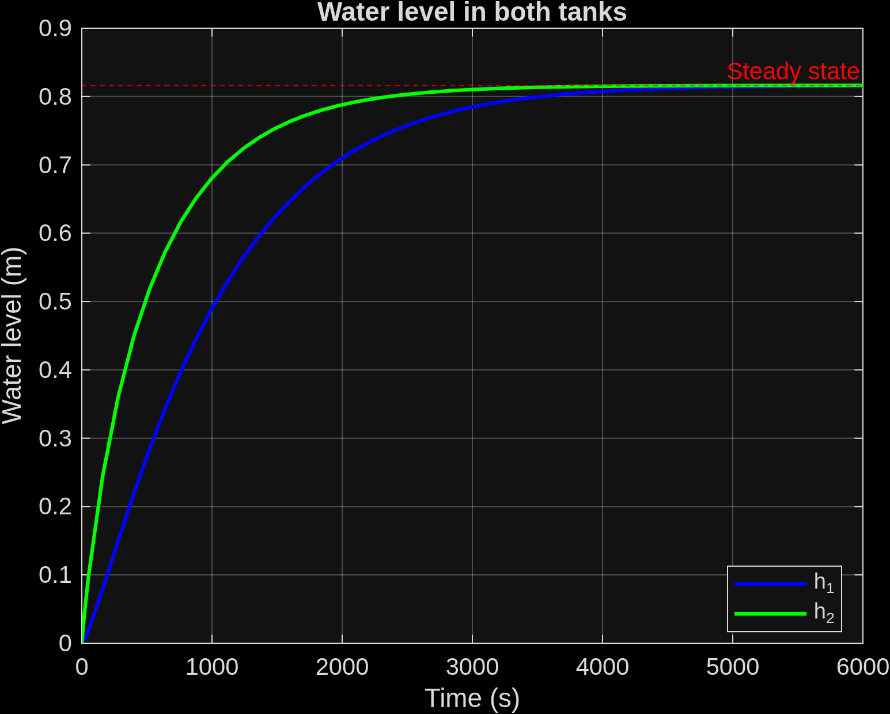
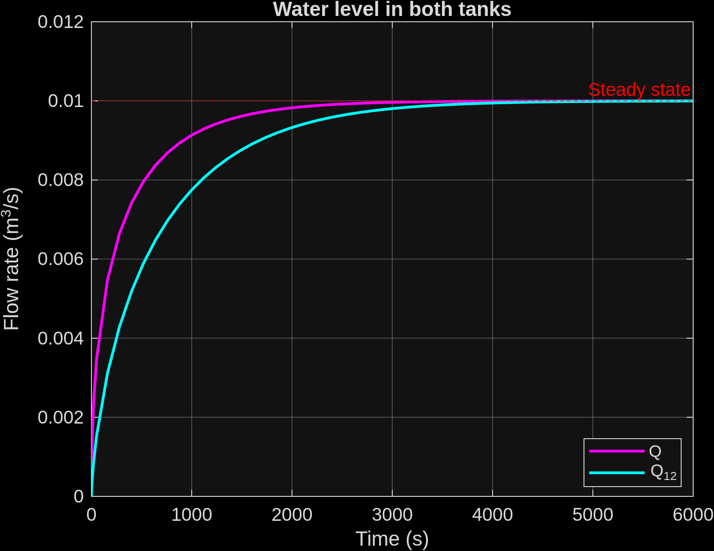

# Two-Tank Water System Simulation

## Overview

This MATLAB/Simulink model simulates a two-tank water system as part of a **Model Predictive Control (MPC)** project. The simulation finds steady-state values for water levels and flow rates, which are essential for linearization and controller design.

## System Description

### Physical System

Two cylindrical tanks connected in series:
- **Tank 1 (Upper)**: Receives inflow Q from pump
- **Tank 2 (Lower)**: Receives flow Q₁₂ from Tank 1, outputs flow Q

Water flows through connecting pipes with smaller cross-sectional areas.

### Mathematical Model

The system is described by nonlinear differential equations:

```
A₁ · dh₁/dt = Q - a₁√(2g·h₁)
A₂ · dh₂/dt = a₁√(2g·h₁) - a₂√(2g·h₂)
```

Where:
- A₁ = A₂ = 4 m² (tank cross-sectional areas)
- a₁ = a₂ = 0.0025 m² (pipe cross-sectional areas)
- g = 9.81 m/s² (gravitational acceleration)

### Control Objective

For MPC design, the goal is to maintain **h₂ = 0.8 m** despite disturbances by manipulating the inflow Q.

## Steady-State Results

| Parameter | Value | Unit |
|-----------|-------|------|
| Water level h₁ | 0.816 | m |
| Water level h₂ | 0.816 | m |
| Flow rate Q (inflow) | 0.01 | m³/s |
| Flow rate Q₁₂ (inter-tank) | 0.01 | m³/s |

**Note**: At steady-state, both tanks reach the same level (0.816 m) because Q = Q₁₂ when system is at equilibrium.

## Linearized Model

For MPC implementation, the system is linearized around the steady-state:

```
Δdh₁/dt = -(g·a₁)/(A₁·√h₁)·Δh₁ + (1/A₁)·ΔQ
Δdh₂/dt = (g·a₁)/(A₂·√h₁)·Δh₁ - (g·a₂)/(A₂·√h₂)·Δh₂
```

State-space form: **x(k+1) = A·x(k) + B·u(k) + G·d(k)**

## Files

| File | Description |
|------|-------------|
| `TwoTankModel.slx` | Simulink model |
| `run_model.m` | MATLAB script to run simulation and generate plots |
| `docs/subject_predictive_control.pdf` | Assignment subject |
| `docs/tank_levels.png` | Water levels over time |
| `docs/flows.png` | Flow rates over time |

## Running the Model

1. Open MATLAB
2. Run the simulation script:
   ```matlab
   run_model
   ```
3. Plots are saved to `docs/` directory

## Results

### Tank Levels


Both tanks reach steady-state at 0.816 m after approximately 3000 seconds.

### Flow Rates


Both flow rates stabilize at 0.01 m³/s (10⁻² m³/s).

## Next Steps (MPC)

This steady-state analysis is the foundation for:
1. Linearizing the nonlinear model
2. Designing MPC controller
3. Implementing predictive control to maintain h₂ at setpoint
4. Testing disturbance rejection
