# Two-Tank Water System Simulation

## Project Structure

Scripts to recreate models for each task are located in `task_*/` directory alongside with different helper functions needed for the runtime. Results are located under task subdirectory inside `docs/`.
---

## Overview

This MATLAB/Simulink project simulates a two-tank water system for a **Predictive Control** semestral project. The system consists of two cylindrical tanks connected in series, where the goal is to learn system modelling, simulation, compare MPC and cascade PI control.

---

## System Description

### Physical System

- **Tank 1 (Upper)**: Receives inflow $Q$ from pump
- **Tank 2 (Lower)**: Receives flow $Q_{12}$ from Tank 1, outputs flow $Q_2$

Water flows through connecting pipes with smaller cross-sectional areas than the tanks.

---

## Task 1: Physical-Mathematical Model and Steady-State Analysis

### Objective

Create the nonlinear physical model and find the steady-state operating point of the system.

### Mathematical Modeling

The nonlinear model is derived from two fundamental principles:

#### Mass Balance Equation

For each tank, the rate of change of water volume equals the difference between inflow and outflow:

$A_1 \cdot \frac{dh_1}{dt} = Q_{in} - Q_{out}$

$A_2 \cdot \frac{dh_2}{dt} = Q_{in} - Q_{out}$

Where $A$ is the cross-sectional area of the tank.

#### Torricelli's Law

Water outflow through an orifice is proportional to the square root of the water height above the orifice:

$Q = a \cdot \sqrt{2gh}$

Where:
- $a$ = pipe cross-sectional area $[m^2]$
- $g$ = gravitational acceleration $[9.81 \, m/s^2]$
- $h$ = water height $[m]$

#### System Equations

Combining both principles, the complete nonlinear model for the two-tank system is:

$A_1 \cdot \frac{dh_1}{dt} = Q - a_1\sqrt{2g \cdot h_1}$

$A_2 \cdot \frac{dh_2}{dt} = a_1\sqrt{2g \cdot h_1} - a_2\sqrt{2g \cdot h_2}$

- Tank 1: inflow $Q$ from pump, outflow through pipe $a_1$ to Tank 2
- Tank 2: inflow from Tank 1 ($a_1\sqrt{2gh_1}$), outflow through pipe $a_2$

### Implementation

- **Simulink Model**: `task_1/TwoTankModel.slx`
- **Run Script**: `task_1/run_model.m`

The nonlinear model implements these equations for both tanks. The simulation runs for 10000 s.

### Steady-State Results

| Parameter | Value | Unit |
|-----------|-------|------|
| Water level $h_1$ | 0.816 | $[m]$ |
| Water level $h_2$ | 0.816 | $[m]$ |
| Flow rate $Q$ (inflow) | 0.01 | $[m^3/s]$ |
| Flow rate $Q_{12}$ (inter-tank) | 0.01 | $[m^3/s]$ |

**Note**: At steady-state, both tanks reach the same level (0.816 m) because $Q = Q_{12}$ when the system is at equilibrium.

### Results

Both tanks reach steady-state at 0.816 m after approximately 3000 seconds. The flow rates stabilize at $0.01 \, [m^3/s]$.

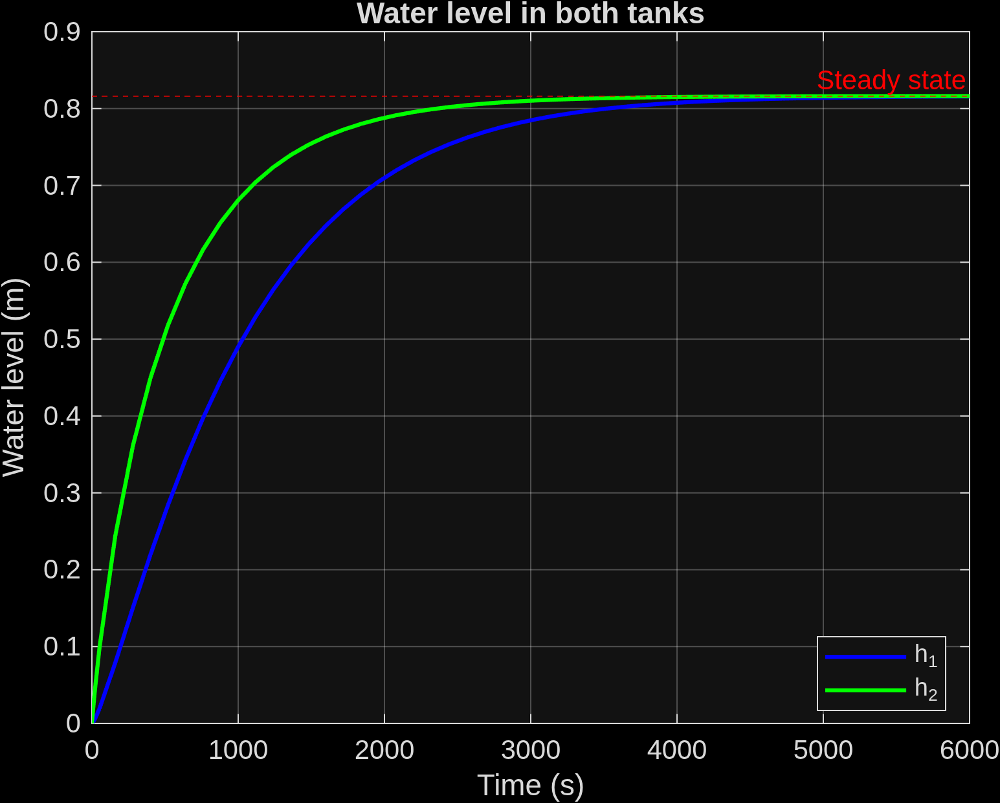

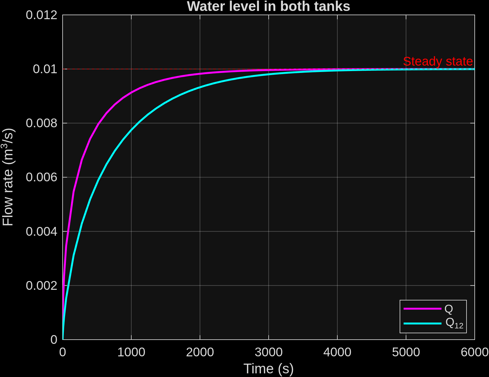

---

## Task 2: Linearization in Deviation Form

### Objective

Linearize the nonlinear model around the steady-state operating point and implement it using both state-space and transfer function representations. Compare all three models (nonlinear, linear SS, linear TF) with different input step sizes.

### Linearized Model

The system is linearized around the steady-state ($h_{1s} = h_{2s} = 0.816 \, [m]$, $Q_s = 0.01 \, [m^3/s]$). The linearized equations in deviation form are:

$\frac{d\Delta h_1}{dt} = -\frac{g \cdot a_1}{A_1 \cdot \sqrt{h_1}} \cdot \Delta h_1 + \frac{1}{A_1} \cdot \Delta Q$

$\frac{d\Delta h_2}{dt} = \frac{g \cdot a_1}{A_2 \cdot \sqrt{h_1}} \cdot \Delta h_1 - \frac{g \cdot a_2}{A_2 \cdot \sqrt{h_2}} \cdot \Delta h_2$

### Implementation

| File | Description |
|------|-------------|
| `task_2/create_linearized_models.m` | Main script that computes linearization coefficients and builds both models |
| `task_2/build_ss_model.m` | Creates State-Space Simulink model (LinearSS.slx) |
| `task_2/build_tf_model.m` | Creates Transfer Function Simulink model (LinearTF.slx) |
| `task_2/run_model_comparison.m` | Compares all three models with different $Q_{in}$ step sizes (+10%, +30%, +50%) |

### Model Comparison

The comparison script simulates a step input in $Q_{in}$ (the inflow rate) with three different magnitudes:
- **+10%** of steady-state flow ($\Delta Q = 0.001 \, [m^3/s]$)
- **+30%** of steady-state flow ($\Delta Q = 0.003 \, [m^3/s]$)
- **+50%** of steady-state flow ($\Delta Q = 0.005 \, [m^3/s]$)

For each step size, the script compares:
1. **Nonlinear model** (original TwoTankModel.slx) - outputs absolute $h_2$
2. **Linear State-Space model** (LinearSS.slx) - outputs deviation $\Delta h_2$, converted to absolute
3. **Linear Transfer Function model** (LinearTF.slx) - outputs deviation $\Delta h_2$, converted to absolute

The results show how well the linear approximations match the nonlinear model for small and larger disturbances.

### State-Space Representation

State-space form: $\mathbf{x}(k+1) = \mathbf{A} \cdot \mathbf{x}(k) + \mathbf{B} \cdot \mathbf{u}(k) + \mathbf{G} \cdot \mathbf{d}(k)$

Output equation: $\mathbf{y} = \mathbf{C} \cdot \mathbf{x} + \mathbf{D} \cdot \mathbf{u}$

Where the output is $h_2$ (water level in Tank 2).

### Results

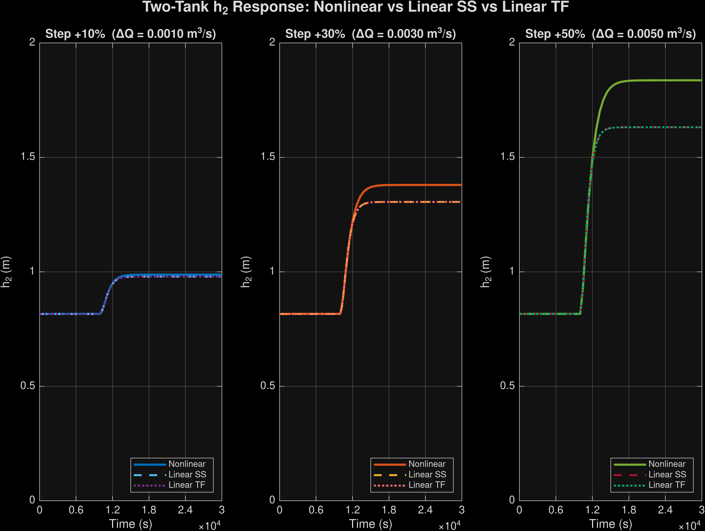

The plot shows the response of $h_2$ for all three step sizes (+10%, +30%, +50%), demonstrating how well the linear approximations match the nonlinear model across different disturbance magnitudes.

---

## Task 3: Control Valves with First-Order Dynamics

### Objective

Extend the nonlinear two-tank model from Task 1 by adding two control valves — one on the outlet of Tank 1 (controlling $Q_{12}$) and one on the outlet of Tank 2 (controlling $Q_{out}$).

### Mathematical Model

#### Valve Flow Equation

The fixed orifice flow equation from Task 1:

$Q = a \cdot \sqrt{2g \cdot h}$

was replaced by a controllable valve flow equation:

$Q = K_v \cdot z \cdot \sqrt{2g \cdot h}$

Where:
- $z \in [0,1]$ is the valve opening position ($0$ = fully closed, $1$ = fully open)
- $K_v$ is the valve flow factor $[m^2]$

#### Valve Dynamics

Each valve has first-order dynamics modelling the physical lag of the valve actuator. The commanded position $z_{cmd}$ does not take effect instantly — the actual position $z$ responds as:

$\tau_v \cdot \frac{dz}{dt} = z_{cmd} - z$

Which in transfer function form is:

$\frac{Z(s)}{Z_{cmd}(s)} = \frac{1}{\tau_v \cdot s + 1}$

In Simulink, this is implemented as a State-Space block with:
- $A = -1/\tau_v$
- $B = 1/\tau_v$
- $C = 1$, $D = 0$

Followed by a Saturation block clamping $z$ to $[0, 1]$.

### Constants

| Parameter | Value | Unit | Justification |
|-----------|-------|------|---------------|
| $K_v$ | 0.005 | $[m^2]$ | Chosen so nominal operating point ($h_{1ss} = h_{2ss} = 0.816 \, [m]$, $Q_{ss} = 0.01 \, [m^3/s]$) is maintained at $z_{ss} = 0.5$. Derived from: $K_v = Q_{ss} / (z_{ss} \cdot \sqrt{2 \cdot g \cdot h_{ss}}) = 0.01 / (0.5 \cdot 4.0) = 0.005 \, [m^2]$ |
| $\tau_v$ | 10 | $[s]$ | Chosen to be realistic for an industrial control valve while remaining fast relative to the tank time constant ($\tau_{tank} \approx 652 \, [s]$). The valve fully settles in approximately $3\tau_v = 30 \, [s]$, which is less than 5% of the dominant system time constant. |
| $z_{ss}$ | 0.5 | $[-]$ | Nominal steady-state opening for both valves. Symmetric choice ensures equal headroom for opening and closing. |

### Implementation

- **Simulink Model**: `task_3/model_w_valves.slx`
- **Build Script**: `task_3/build_model_w_valves.m`
- **Run Script**: `task_3/run_valve_test.m`

### Test Description

Both valves start at $z_{ss} = 0.5$ and the system starts at the steady-state operating point. At $t = 500 \, [s]$, both valves receive a simultaneous step command:
- **Valve 1** ($z_1$): opens from 0.5 to 0.8 — increases $Q_{12}$
- **Valve 2** ($z_2$): closes from 0.5 to 0.3 — reduces $Q_{out}$

The actual valve positions lag behind the step commands due to the first-order dynamics with $\tau_v = 10 \, [s]$.

### Results

$h_1$ decreases after $t = 500 \, [s]$ because Valve 1 opens and drains Tank 1 faster than $Q_{in}$ replenishes it.

$h_2$ initially rises because Valve 1 increases inflow to Tank 2 while Valve 2 simultaneously restricts outflow. After the transient, $h_2$ settles at a new higher steady state.

The valve position plots show the first-order lag — actual $z$ tracks $z_{cmd}$ with a smooth exponential approach rather than an instantaneous jump.

The saturation block has no visible effect in this test since neither valve command exceeds $[0, 1]$, but it protects the model during edge-case inputs.

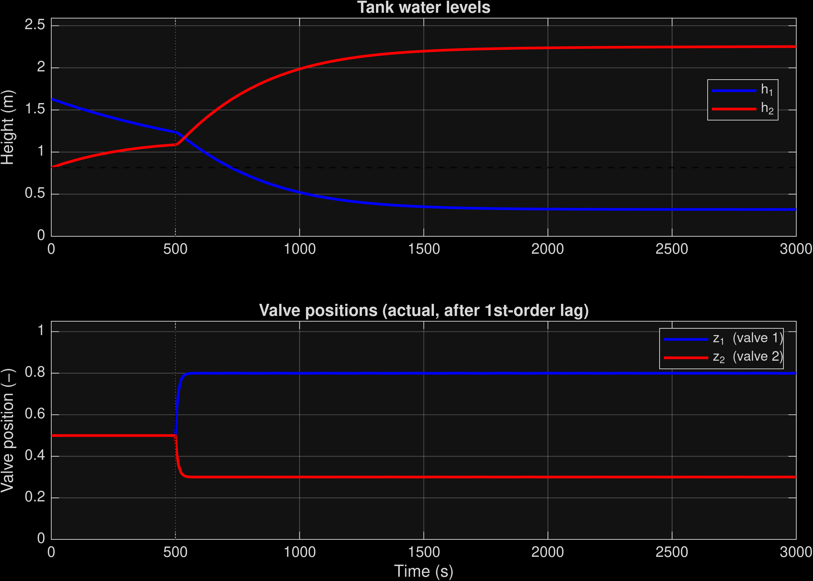

---

## Task 4: Cascade PI Control

### Objective

Implement cascade proportional-integral (PI) control for both tanks. Each tank has two PI regulators in series: a master loop controlling tank level and a slave loop controlling the outlet flow from that tank.

### Physical Principle

A cascade controller improves response by using a slower outer (master) loop to set the setpoint of a faster inner (slave) loop. The slave loop has direct access to the manipulated variable (valve position) and can respond quickly to disturbances. The master loop only cares about the tank level and does not worry about the dynamics of valve actuation.

For each tank:
- **Master**: measures level $h$, compares to reference $h_{ref}$, outputs desired flow $Q_{ref}$
- **Slave**: measures actual outlet flow $Q_{meas}$, compares to $Q_{ref}$, outputs valve $z_{cmd}$

Both loops use PI control (proportional + integral, no derivative).

### Mathematical Model

#### Master Loop Plant (for tuning)

From desired outlet flow to tank level. Linearised:

$\frac{dh}{dt} = \frac{Q_{in} - Q_{ref}}{A}$

In Laplace form: $H(s) = \frac{1}{A \cdot s}$ — an integrator.

With slave closed, the effective plant includes the slave closed-loop response.

#### Slave Loop Plant (for tuning)

From valve command $z_{cmd}$ to measured outlet flow. Linearised:

- Valve dynamics: $\frac{dz}{dt} = \frac{z_{cmd} - z}{\tau_v}$ → $Z(s) = \frac{1}{\tau_v \cdot s + 1}$
- Flow: $Q = K_v \cdot z \cdot \sqrt{2gh}$ linearised at operating point → $Q \approx K_{v,lin} \cdot z$
- Combined: $\frac{Q(s)}{Z_{cmd}(s)} = \frac{K_{v,lin}}{\tau_v \cdot s + 1}$

Where $K_{v,lin} = K_v \cdot \sqrt{2gh_{ss}} = 0.005 \cdot \sqrt{19.62 \cdot 0.816} \approx 0.020 \, [m^3/s]$.

### Autotuning using pidtune

MATLAB's Control System Toolbox function `pidtune()` automatically computes PI gains for each plant:

1. **Slave tuning**: `pidtune(G_slave, 'PI')` → $K_{p,slave}$, $K_{i,slave}$
   - Plant is first-order, well-behaved, tuning is aggressive.

2. **Master tuning**: `pidtune(G_master_with_slave, 'PI')` → $K_{p,master}$, $K_{i,master}$
   - Plant includes closed-loop slave; master is inherently slower due to tank inertia.

The `pidtune` function selects gains to balance speed (bandwidth) and robustness. No manual gain scheduling or trial-and-error needed.

### Initial Conditions

Initial conditions were set in each PI block to the value that produces the required steady-state output when error is zero:

$IC_{master} = \frac{Q_{ss}}{K_{i,master}}$

$IC_{slave} = \frac{z_{ss}}{K_{i,slave}}$

Howeverm, initial conditions were not used because $K_{i,master}$ was small (0.0045), which would require unrealistic values (around 15, when max flow is set to 0.02). As a result, small spikes persist at the start of simulation.

### Test Scenario

At $t = 500 \, [s]$, the reference level $h_{ref}$ steps from $h_{ss} = 0.816 \, [m]$ to $1.2 \cdot h_{ss} \approx 0.979 \, [m]$ (+20% step in both tanks simultaneously). The same reference is used for both tanks.

The cascade controller responds:
- Master loop 1 detects $h_1 < h_{ref}$ → decreases $Q_{12,ref}$ (reduces outflow from tank 1)
- Slave loop 1 adjusts $z_1$ to track $Q_{12,ref}$ → valve opens more as needed
- Tank 1 level rises toward the reference
- Similarly for tank 2 with $Q_{out}$ and $z_2$

The slave loops are fast ($\tau_v = 10 \, [s]$, PI tuned for ~1 second response), so they track their flow setpoints within 10-30 seconds. The master loops are slower (tank time constant ~650 s), so the level reaches the new reference over several minutes.

### Results

After the reference step at $t = 500 \, [s]$:

- Both $h_1$ and $h_2$ begin rising toward $h_{ref}$ immediately (slave loop acts fast)
- $h_1$ and $h_2$ track closely to each other throughout (cascade ensures coordinated response)
- There is no overshoot or oscillation (PI tuning is smooth)
- Steady-state error is zero (integral action in master loop)
- Both tanks settle at the new reference level within ~30-50 minutes
- The actual level curves are smooth S-shaped (second-order response from cascade)

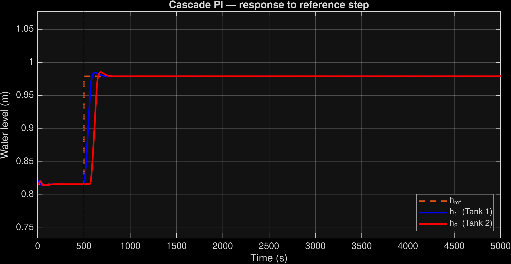

The plot shows $h_{ref}$ as a dashed line and $h_1$, $h_2$ as solid lines. The reference step is marked with a vertical dotted line. Since both tanks are identical and use identical controllers, $h_1$ and $h_2$ follow nearly identical trajectories and track $h_{ref}$ with the same dynamics.

### Simulation Data Logged

- $h_1$, $h_2$: tank levels (from integrators)
- $h_{ref}$: reference level (same for both tanks)
- $z_1$, $z_2$: actual valve positions (after saturation, with first-order lag)
- $Q_{meas,1}$, $Q_{meas,2}$: measured outlet flows (computed from $h$ and $z$)

---

## Task 5: Centralized MPC with Slave PI Loops

### Objective

Replace the independent master PI controllers from Task 4 with a centralized Model Predictive Controller (MPC). The MPC controls both tanks simultaneously while retaining the fast slave PI flow loops from the cascade structure.

### Motivation for MPC

In the cascade PI solution from Task 4, the two master controllers operated independently. However, the two-tank system is strongly coupled:

- Changing $Q_{12}$ directly affects both tanks
- Increasing outflow from Tank 1 increases inflow to Tank 2
- The interaction between tanks can lead to suboptimal control when using separate master controllers

A centralized MPC considers both tank levels simultaneously and computes coordinated control actions for:
- $Q_{12,ref}$ — desired flow from Tank 1 to Tank 2
- $Q_{out,ref}$ — desired outlet flow from Tank 2

The MPC also allows explicit handling of actuator and flow constraints.

### Simplified Plant Model

The slave PI loops are much faster than the tank dynamics:
- Slave loop settling time: approximately $10-30 \, [s]$
- Tank time constant: approximately $650 \, [s]$

Therefore, the slave loops are assumed ideal from the MPC perspective:

$Q_{12} \approx Q_{12,ref}$

$Q_{out} \approx Q_{out,ref}$

Using the mass balance equations, the simplified linear plant becomes:

$\frac{dh_1}{dt} = \frac{Q_{in} - Q_{12,ref}}{A}$

$\frac{dh_2}{dt} = \frac{Q_{12,ref} - Q_{out,ref}}{A}$

### State-Space Representation

The plant is represented as a two-state, two-input linear system.

#### States

$\mathbf{x} = [h_1 \;\; h_2]^T$

#### Manipulated Variables

$\mathbf{u} = [Q_{12,ref} \;\; Q_{out,ref}]^T$

#### Measured Disturbance

$\mathbf{d} = [Q_{in}]$

The measured disturbance $Q_{in}$ is included because the inflow is known and directly affects Tank 1 dynamics.

The continuous-time state-space model is:

$\dot{\mathbf{x}} = \mathbf{A}\mathbf{x} + \mathbf{B}\mathbf{u} + \mathbf{G}\mathbf{d}$

With:

$\mathbf{A} =
\begin{bmatrix}
0 & 0 \\
0 & 0
\end{bmatrix}$

$\mathbf{B} =
\begin{bmatrix}
-\frac{1}{A} & 0 \\
\frac{1}{A} & -\frac{1}{A}
\end{bmatrix}$

$\mathbf{G} =
\begin{bmatrix}
\frac{1}{A} \\
0
\end{bmatrix}$

$\mathbf{C} =
\begin{bmatrix}
1 & 0 \\
0 & 1
\end{bmatrix}$

The outputs are the tank levels $h_1$ and $h_2$.

### Nominal Operating Point

The MPC controller is designed around the steady-state operating point:

| Parameter | Value |
|-----------|-------|
| $h_{1ss}$ | $0.816 \, [m]$ |
| $h_{2ss}$ | $0.816 \, [m]$ |
| $Q_{12,ss}$ | $0.01 \, [m^3/s]$ |
| $Q_{out,ss}$ | $0.01 \, [m^3/s]$ |
| $Q_{in,ss}$ | $0.01 \, [m^3/s]$ |

The steady-state consistency condition is satisfied:

$\mathbf{A}x_{ss} + \mathbf{B}u_{ss} + \mathbf{G}d_{ss} = 0$

This condition is required by the MATLAB MPC Toolbox for correct prediction around the operating point.

### Discretization

The MPC requires a discrete-time plant model. The continuous system is discretized using zero-order hold:

`c2d(plant_c, Ts_mpc, 'zoh')`

Where:
- `plant_c` = continuous-time model
- `Ts_mpc` = MPC sampling time

### MPC Configuration

The MPC minimizes a cost function that balances:
- Reference tracking accuracy
- Smoothness of manipulated variable changes
- Constraint satisfaction

The controller uses:
- Equal output weights for $h_1$ and $h_2$
- Rate penalties on manipulated variables to prevent abrupt flow changes
- Hard constraints on $Q_{12,ref}$ and $Q_{out,ref}$

Because the system is symmetric, the controller produces nearly identical responses for both tanks.

### Implementation

- **Simulink Model**: `task_5/mpc_model.slx`
- **Build Script**: `task_5/create_model_w_mpc.m`
- **Run Script**: `task_5/run_mpc_model.m`

### Test Scenario

At $t = 500 \, [s]$, the reference level steps from:

$h_{ref} = 0.816 \, [m]$

to:

$h_{ref} = 1.2 \cdot h_{ss} \approx 0.979 \, [m]$

The same reference is applied to both tanks simultaneously.

The MPC responds by:
- Decreasing $Q_{12,ref}$ to reduce draining from Tank 1
- Decreasing $Q_{out,ref}$ to retain water in Tank 2
- Coordinating both flows to ensure smooth level tracking

### Results

The MPC controller successfully tracks the reference step applied at
$t = 500 \, [s]$, where both tank levels rise from the steady-state value
$h_{ss} = 0.816 \, [m]$ to the new reference
$h_{ref} \approx 0.979 \, [m]$. Both $h_1$ and $h_2$ follow nearly identical
trajectories due to the symmetric system structure and equal MPC output
weighting. The response is fast and well damped, with very small overshoot,
no sustained oscillations, and zero steady-state error. Compared to the
cascade PI controller from Task 4, the centralized MPC achieves significantly
faster settling while coordinating both tanks simultaneously through optimal
manipulation of $Q_{12,ref}$ and $Q_{out,ref}$. A small transient spike is
visible at the beginning of the simulation due to initialization effects, but
it disappears quickly and does not affect closed-loop stability.

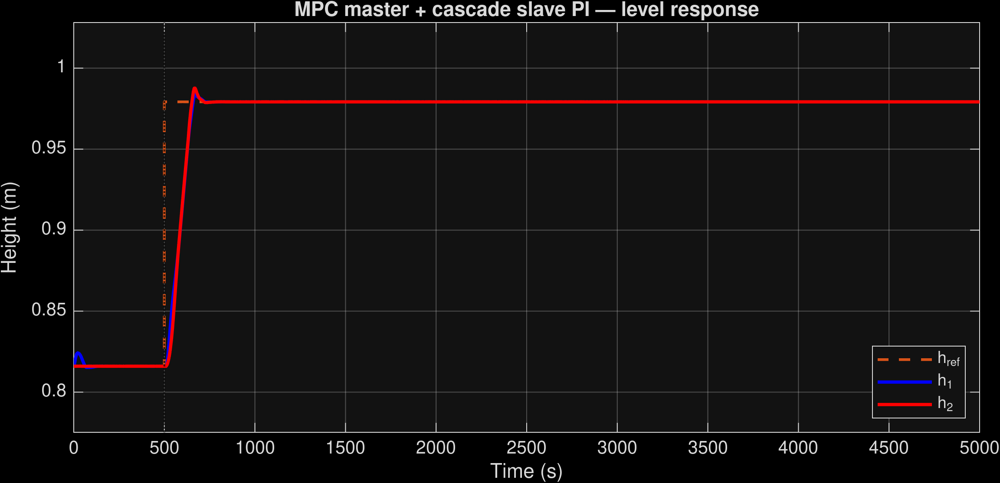

The plot shows:
- $h_{ref}$ as a dashed line
- $h_1$ and $h_2$ as solid lines

Since the plant and controller are symmetric, both tanks follow nearly identical trajectories toward the new operating point.

### Simulation Data Logged

- $h_1$, $h_2$: tank levels
- $h_{ref}$: reference level
- $Q_{12,ref}$: MPC reference flow from Tank 1 to Tank 2
- $Q_{out,ref}$: MPC reference outlet flow from Tank 2
- MPC manipulated variable trajectories
- Slave PI valve commands and actual valve positions

---

## Task 6: Input Disturbance Simulation

### Objective

Modify the previously developed MATLAB/Simulink model to simulate disturbance
behaviour of the inlet flow $Q_{in}$. The disturbance signal should model
random oscillations of the inflow around its steady-state operating value
within the range of $\pm 70\%$.

### Implementation

The disturbance generator creates a noisy version
of the nominal inflow by multiplying the constant steady-state input by a
random factor:

$Q_{disturbed} = Q_{ss} \cdot (1 + \delta)$

where $\delta$ is a uniformly distributed random variation within the selected
disturbance percentage range. The random signal is generated using a fixed
seed (`rng(42)`), ensuring repeatable simulation results. The disturbed input
is additionally limited between $0$ and $2 \cdot Q_{ss}$ to avoid unrealistic
negative or excessively large flow values.

### Results

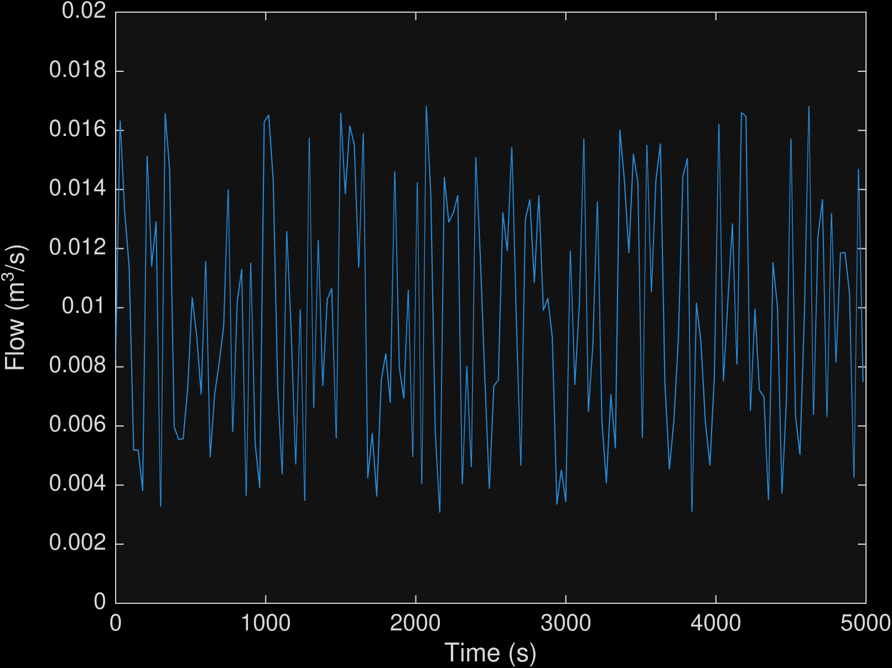

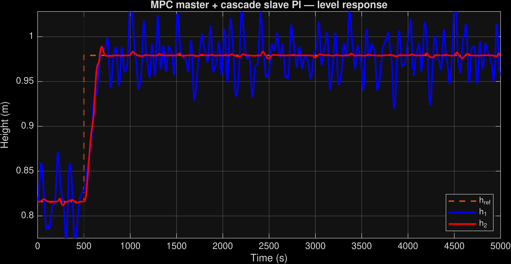

The resulting plot shows that the MPC controller successfully regulates the
system despite continuous input disturbances. Tank level $h_2$ remains tightly
controlled around the reference value with only very small deviations, while
$h_1$ exhibits significantly larger oscillations because it is directly affected
by the disturbed inflow. The controller continuously adjusts
$Q_{12,ref}$ and $Q_{out,ref}$ to compensate for the disturbances and maintain
stable operation. The results demonstrate the disturbance rejection capability
of the centralized MPC controller and its ability to preserve reference
tracking under noisy operating conditions.

## Task 7: Final MPC and Cascade PID Comparison

### Objective

Compare the behaviour of the two implemented control strategies:
- cascade PI control from Task 4,
- centralized MPC with cascade slave PI loops from Task 5,

during simultaneous filling and emptying of both tanks. The comparison is
performed using simulation experiments with time-varying reference signals
while also introducing disturbances to the inlet flow $Q_{in}$.

### Implementation

The filling and emptying behaviour is generated using a custom reference signal
function implemented in MATLAB. The function creates a triangular reference
trajectory consisting of:
- a linear rise phase (tank filling),
- an optional hold phase,
- and a linear fall phase (tank emptying).

The generated signal starts from the initial value, increases linearly to the
desired peak level, and then decreases back to the original operating point.
The simulation uses:
- sampling time: $30 \, [s]$
- total simulation time: $10000 \, [s]$
- rise time: $5000 \, [s]$
- fall time: $5000 \, [s]$

The reference trajectory for $h_1$ is generated directly by the
`set_reference()` function. The reference for $h_2$ is obtained by applying an
offset using the `add_offset()` function so both tanks follow coordinated but
shifted trajectories.

Both reference signals are loaded into Simulink using `From Workspace` blocks,
allowing the controllers to track predefined time-varying operating points
during simulation.

Disturbances on the inlet flow $Q_{in}$ are generated using the random signal
generator from Task 6, where the inflow oscillates around its steady-state
value within a specified disturbance range. This allows direct comparison of
the robustness and tracking performance of the PI cascade controller and the
MPC-based controller under identical disturbance conditions.

### Results
input_flow.png  mpc_h1.png  mpc_h2.png  pid_h1.png  pid_h2.png

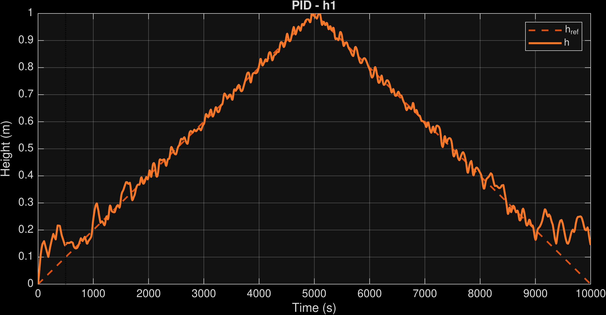
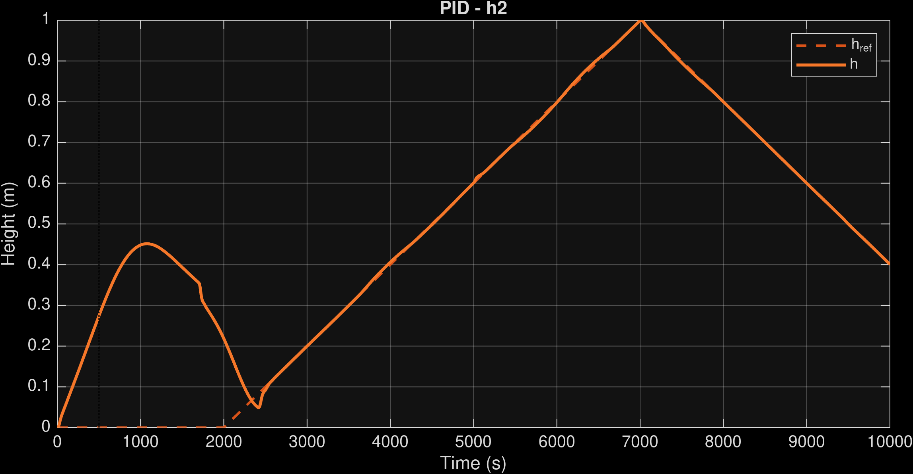
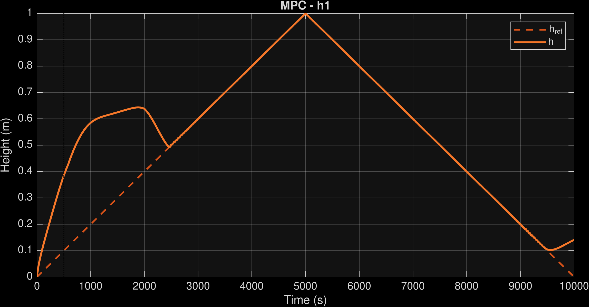
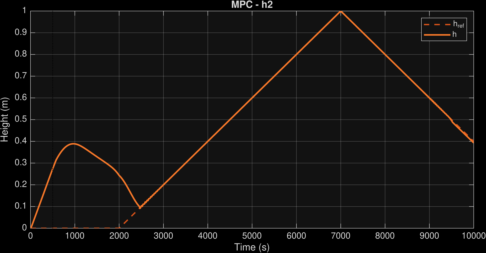

Both control strategies successfully tracked the filling and emptying
reference trajectories while maintaining stable operation under inflow
disturbances. The cascade PI controller handled the task well and achieved
acceptable reference tracking with stable behaviour throughout the simulation.
However, the MPC-based controller produced noticeably smoother responses and
followed the reference trajectory more accurately, especially during the
dynamic filling and emptying phases.

In previous tasks, the MPC controller used a sampling time of
$30 \, [s]$, which limited its prediction accuracy and resulted in performance
comparable to the cascade PI controller. After reducing the MPC sampling time
to $1 \, [s]$, the controller was able to react significantly faster to both
reference changes and disturbances. As a result, the MPC output closely
matches the reference trajectory while maintaining smooth control action and
minimal oscillations. The comparison demonstrates the importance of sampling
time selection in predictive control and confirms the superior tracking
capability of the MPC controller when configured with sufficiently fast
sampling.
